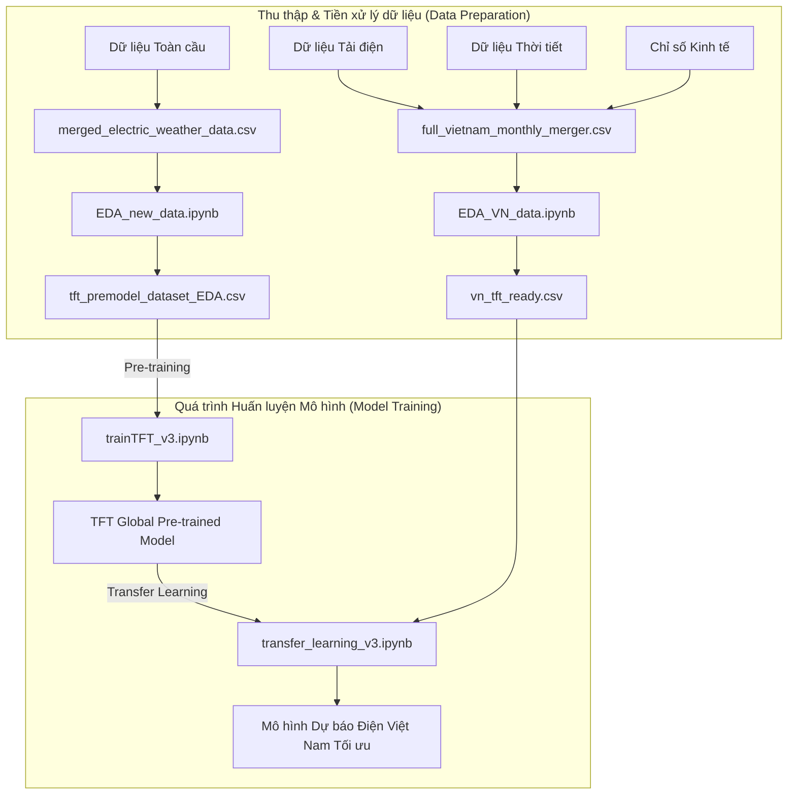

# TFT-Based Cross-Country Transfer Learning with Economic Covariates for Electricity Generation Forecasting

[](https://www.python.org/)
[](https://pytorchlightning.ai/)
[](LICENSE)

## 📖 Tổng quan (Abstract)

Dự án này là mã nguồn chính thức cho bài báo nghiên cứu: **"TFT-Based Cross-Country Transfer Learning with Economic Covariates for Electricity Generation Forecasting"**.

Nghiên cứu tập trung vào việc dự báo sản lượng điện tại Việt Nam bằng cách sử dụng mô hình **Temporal Fusion Transformer (TFT)** kết hợp với phương pháp **Transfer Learning** (Học chuyển giao). Để cải thiện độ chính xác, mô hình tích hợp nhiều nguồn dữ liệu đa dạng bao gồm:
- Tải điện (Electricity Load)
- Dữ liệu thời tiết (Weather Data)
- Các chỉ số kinh tế vĩ mô (Economic Covariates)

Bằng cách pre-train mô hình trên dữ liệu từ nhiều quốc gia khác nhau và fine-tune trên dữ liệu đặc thù của Việt Nam, mô hình đạt được hiệu năng vượt trội trong việc nắm bắt các xu hướng và biến động dài hạn.

---

## 🏗 Kiến trúc & Luồng xử lý dữ liệu (Data Workflow)



---

## 📂 Cấu trúc thư mục (Project Structure)

```text
📁 NCKH/
│
├── 📁 data/                        # Dữ liệu raw và đã qua tiền xử lý
│   ├── full_vietnam_monthly_merger.csv    # Dữ liệu gốc Việt Nam
│   ├── merged_electric_weather_data.csv   # Dữ liệu gốc Toàn cầu
│   ├── vn_tft_ready.csv                   # Dữ liệu Việt Nam sẵn sàng cho TFT
│   └── tft_premodel_dataset_EDA.csv       # Dữ liệu toàn cầu dùng để pretrain
│
├── 📁 notebook/                    # Chứa các Jupyter Notebook phân tích và huấn luyện
│   ├── EDA_VN_data.ipynb                  # EDA cho dữ liệu Việt Nam
│   ├── EDA_new_data.ipynb                 # EDA cho dữ liệu toàn cầu
│   ├── trainTFT_v3.ipynb                  # Pretrain mô hình TFT với dữ liệu toàn cầu
│   └── transfer_learning_v3.ipynb         # Transfer learning cho dữ liệu Việt Nam
│
├── 📁 src/                         # Mã nguồn phụ trợ (thu thập, xử lý pipelines)
│   ├── electricmap_crawl/
│   └── entsoe_crawl/
│
├── 📁 docs/                        # Tài liệu hướng dẫn thêm
│   ├── All_data.md
│   ├── Crawl_guide.md
│   └── DATA_AVAILABILITY.md
│
└── README.md                       # Tài liệu chính của dự án
```

---

## ⚙️ Cài đặt & Chạy mô hình (Setup & Execution)

### 1. Cài đặt môi trường
Đảm bảo bạn đã cài đặt Python 3.8+. Tiến hành cài đặt các thư viện cần thiết:
```bash
pip install -r requirements.txt
```

### 2. Các bước thực hiện (Execution Steps)

Dự án được thực thi tuần tự theo các bước sau:

1. **Chuẩn bị dữ liệu (EDA):**
   - Chạy `notebook/EDA_new_data.ipynb` để xử lý dữ liệu toàn cầu, tạo ra file `tft_premodel_dataset_EDA.csv`.
   - Chạy `notebook/EDA_VN_data.ipynb` để xử lý dữ liệu Việt Nam, tạo ra file `vn_tft_ready.csv`.

2. **Huấn luyện mô hình cơ sở (Pre-training):**
   - Mở và chạy toàn bộ notebook `trainTFT_v3.ipynb`. Quá trình này sẽ sử dụng file `tft_premodel_dataset_EDA.csv` để huấn luyện một mô hình TFT mạnh mẽ trên tập dữ liệu đa quốc gia.

3. **Học chuyển giao (Transfer Learning):**
   - Mở và chạy notebook `transfer_learning_v3.ipynb`. Notebook này sẽ load weights từ mô hình Pre-trained ở bước 2 và tiếp tục fine-tune trên dữ liệu Việt Nam (`vn_tft_ready.csv`).

---

## 📊 Đánh giá & Kết quả (Results)

Mô hình TFT kết hợp Transfer Learning và chỉ số kinh tế cho thấy sự cải thiện đáng kể trong độ chính xác của dự báo (như RMSE, MAE, MAPE) so với các mô hình baseline truyền thống như ARIMA hay LSTM, đặc biệt trong các kịch bản có biến động mạnh.

*(Vui lòng tham khảo bài báo để xem bảng so sánh chi tiết và biểu đồ dự báo cụ thể).*

---
**Tác giả:** Nguyễn Văn Tiến và nhóm nghiên cứu.
