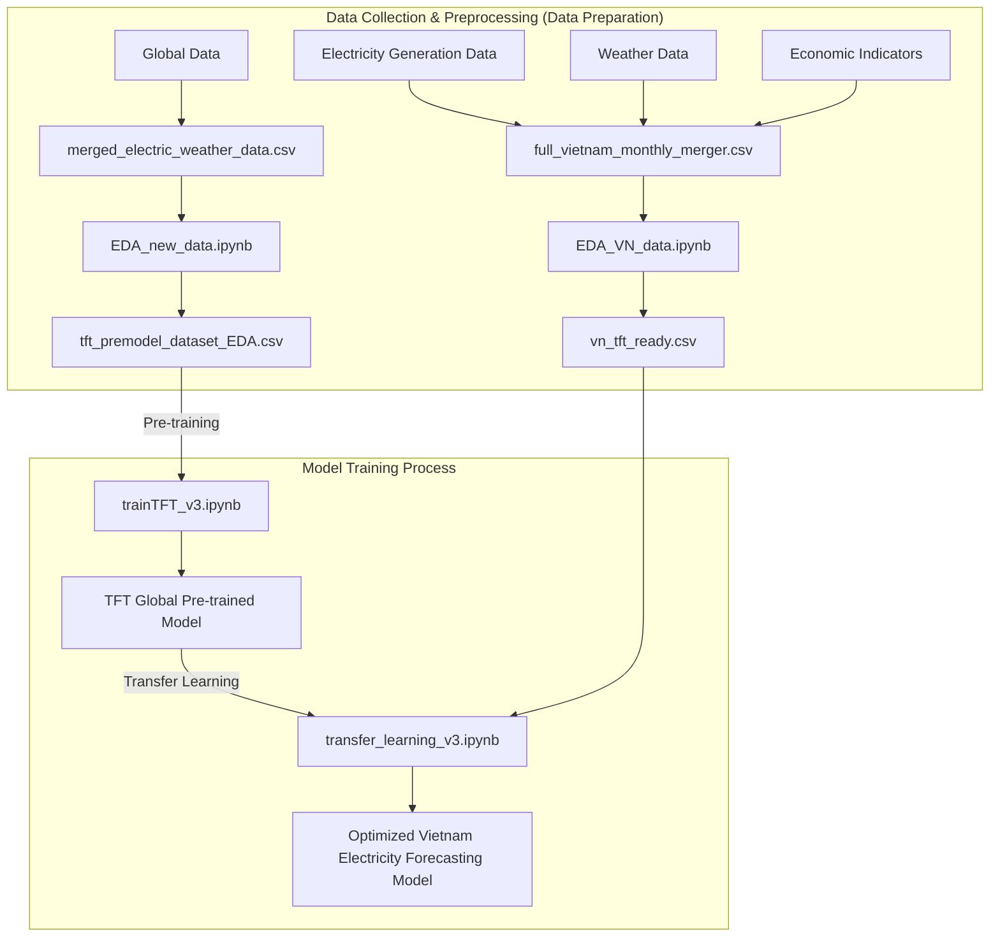

# TFT-Based Cross-Country Transfer Learning with Economic Covariates for Electricity Generation Forecasting

[](https://www.python.org/)
[](https://pytorchlightning.ai/)
[](LICENSE)

*Read this in other languages: [Tiếng Việt](README_vi.md).*

## 📖 Abstract

This project is the official source code for the research paper: **"TFT-Based Cross-Country Transfer Learning with Economic Covariates for Electricity Generation Forecasting"**.

The study focuses on forecasting **electricity generation** broken down by energy source in Vietnam using the **Temporal Fusion Transformer (TFT)** model combined with **Transfer Learning**.

To improve the forecasting accuracy for various energy sources, the model utilizes diverse input variables (covariates) including:
- Weather Data (temperature, precipitation, humidity, solar radiation...)
- Macro-Economic Covariates

By pre-training the model on data from multiple countries and fine-tuning it on Vietnam-specific data, the model achieves superior performance in capturing long-term trends and volatility.

---

## 🏗 Architecture & Data Workflow



---

## 📂 Project Structure

```text
📁 NCKH/
│
├── 📁 data/                        # Raw and preprocessed data
│   ├── full_vietnam_monthly_merger.csv    # Original Vietnam data
│   ├── merged_electric_weather_data.csv   # Original Global data
│   ├── vn_tft_ready.csv                   # Vietnam data ready for TFT
│   └── tft_premodel_dataset_EDA.csv       # Global data used for pretraining
│
├── 📁 notebook/                    # Jupyter Notebooks for analysis and training
│   ├── EDA_VN_data.ipynb                  # EDA for Vietnam data
│   ├── EDA_new_data.ipynb                 # EDA for global data
│   ├── trainTFT_v3.ipynb                  # Pretrain TFT model with global data
│   └── transfer_learning_v3.ipynb         # Transfer learning for Vietnam data
│
├── 📁 src/                         # Auxiliary source code (crawlers, data pipelines)
│   ├── electricmap_crawl/
│   └── entsoe_crawl/
│
├── 📁 docs/                        # Additional documentation
│   ├── All_data.md
│   ├── Crawl_guide.md
│   └── DATA_AVAILABILITY.md
│
└── README.md                       # Main project documentation
```

---

## ⚙️ Setup & Execution

### 1. Environment Setup
Ensure you have Python 3.8+ installed. Install the required libraries by running:
```bash
pip install -r requirements.txt
```

### 2. Execution Steps

The project is executed sequentially in the following steps:

1. **Data Preparation (EDA):**
   - Run `notebook/EDA_new_data.ipynb` to process global data and generate `tft_premodel_dataset_EDA.csv`.
   - Run `notebook/EDA_VN_data.ipynb` to process Vietnam data and generate `vn_tft_ready.csv`.

2. **Base Model Training (Pre-training):**
   - Open and run the entire `trainTFT_v3.ipynb` notebook. This process uses `tft_premodel_dataset_EDA.csv` to train a robust TFT model on a multi-country dataset.

3. **Transfer Learning:**
   - Open and run the `transfer_learning_v3.ipynb` notebook. This notebook loads the weights from the pre-trained model (from step 2) and fine-tunes it on the Vietnam dataset (`vn_tft_ready.csv`).

---

## 📊 Evaluation & Results

The TFT model combined with Transfer Learning and economic covariates shows significant improvement in forecasting accuracy (measured by RMSE, MAE, MAPE) compared to traditional baseline models like ARIMA or LSTM, especially in scenarios with high volatility.

*(Please refer to the paper for detailed comparison tables and specific forecasting charts).*

---
**Authors:** Nguyen Van Tien and the research team.
